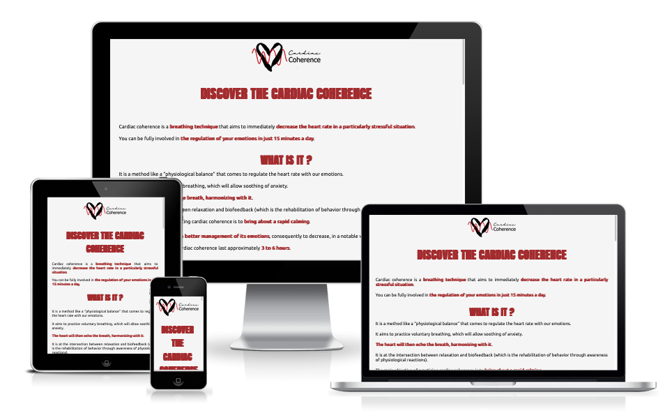
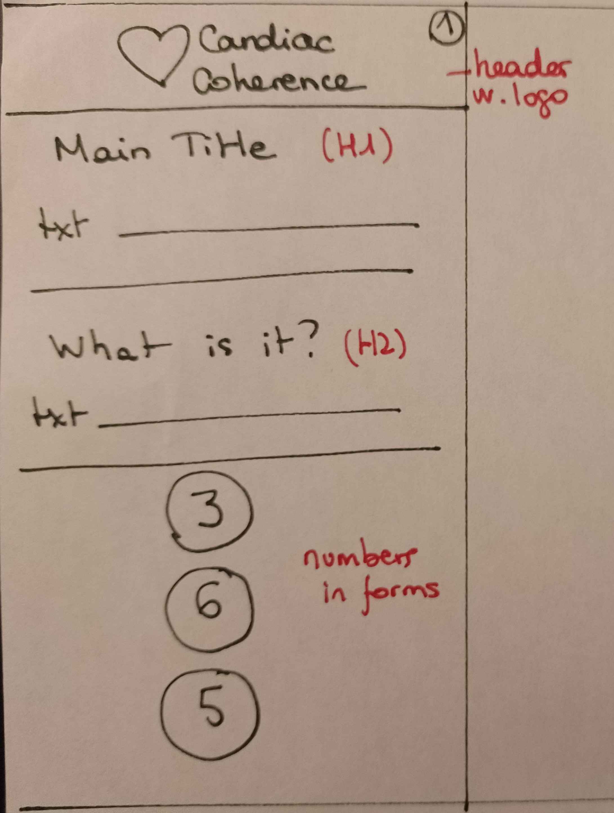
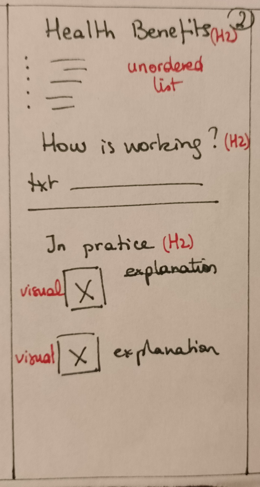
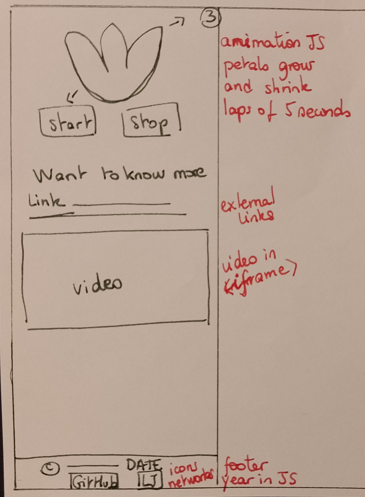

# Cardiac Coherence
This is my project for PP2. It is a one-page informative website on the subject of cardiac coherence. I am an adept of this breathing technique and I want to present it in a simple and concise way to Internet users.

## Wireframes
I would like a one-page website because I don't have a lot of content so it's not wise to have several pages for a few informations. So the user only has to scroll on the page to see all the informations. 

## Features
My site has only one page. The user can find illustrations, interactive elements as well as informative text. My page is divided into several sections:

- __What is Cardiac Coherence__
This part briefly explains what cardiac coherence is. Without going into details, the user can find general information about this breathing technique.

- __3 important numbers__
Here the user can learn about 3 very important numbers in cardiac coherence which are: 365. This is a technical way to remember how to practice cardiac coherence. 365 days in the year for a daily practice but especially 3 times a day, 6 breaths per minute, 5 minutes duration. 

- __Health Benefits__
This section lists some of the recognized benefits of the daily practice of cardiac coherence.

- __How is it working?__
This section goes into the details of the practice. The user will be able to know exactly how to perform cardiac coherence independently. 

- __In pratice__
This section aims to show simply how to achieve heart coherence with short sentences and two drawings to illustrate.
Moreover, an animation is present to guide the user during his practice. By pressing the Start button the animation starts. During 5 seconds, the petals will grow, the user must breathe in during this time. Then, during 5 seconds, the petals will shrink, the user must then exhale. The animation lasts in a loop for 5 minutes. 

- __Want to know more?__
The user can visit an external website to know more about the subject. A video is also available, which the user can watch directly on the page. The video does not start automatically. The video is in english and is about the benefits of the cardiac coherence explain by a doctor.

### Existing Features

- __Header__
My header displays the website logo. There is no navigation or link on the logo as this is a single page site.

- __Footer__
The footer displays the copyright with my name and the current year. This functionality is realized with a JavaScript script.
There are also the logos of my GitHub and LinkedIn accounts. Both links open in windows external to the site.

### Features Left to Implement
- Add the possibility for the user to enter their own time data for the animation. Indeed, for some cases (difficulties to fall asleep or to wake up in the morning) it is possible to modify the 5 seconds to slow down or speed up the breathing time.
I would have liked to propose this possibility at this stage of the project but I have a lot of difficulties with the JavaScript. My mentor reassured me that with the learning of Python, the logic of JavaScript would be more understandable.

## Testing
| Problems                                                                        | Actions                                                                                                                                                                                                                         | Results                         |
|---------------------------------------------------------------------------------|---------------------------------------------------------------------------------------------------------------------------------------------------------------------------------------------------------------------------------|---------------------------------|
| Shapes with numbers are not balanced                                            | Remove some padding and margin values in containers                                                                                                                                                                             | It's better but not perfect     |
| The animation grows but does not shrink when the function in question is called | Added SetTimeout to give a time value so that the browser has time to launch the petals shrink                                                                                                                                  | The animation grows and shrinks |
| Animation grows and shrinks but does not repeat                                 | Adding SetInterval with a time data                                                                                                                                                                                             | The animation is in loop        |
| The animation does not stop                                                     | Creation of two variables, one for setTimeout and another one for setInterval in order to add these variables to clearTimeout and clearInterval. And declaration of clearTimeout and clearTimeout in the stopAnimation function | The animation stops completely  |

### Validator Testing
- HTML
No errors were returned when passing through the official [W3C validator](https://validator.w3.org/nu/)
- CSS
No errors were found when passing through the official [Jigsaw validator](https://jigsaw.w3.org/css-validator/)
- JavaScript
No errors were found when passing through the official [JSHint validator](https://jshint.com/)

### Unfixed Bugs
No unfixed Bugs

## Deployment
The website has been deployed on GitHub pages. The steps of the deployment are as follows:
	- On the project on GitHub, go to Settings
	- And then on GitHub Pages. Select the "Main" branch and save the settings.

The site is live here : https://cecilegaudron.github.io/cardiac-coherence/

## Credits

### Content
- GitHub and LinkedIn icons come from [Font Awesome](https://fontawesome.com/)
- Fonts come from Google Fonts [Google Fonts](https://fonts.google.com/)
- Text comes from C2Care Website [C2Care Website](https://www.c2.care/en/cardiac-coherence/)
- Woman vectors are made by syarifahbrit for Freepik [Freepik Webiste](https://fr.freepik.com/vecteurs-libre/femmes-qui-font-exercices-respiratoires-inspirent-expirent-pour-soulagement-calme-du-stress_12849230.htm#query=cardiaque&position=9&from_view=search&track=sph)
- Heart vector comes from Freepik [Freepik Website](https://fr.freepik.com/vecteurs-libre/ensemble-illustration-coeur-dessine-main_9866239.htm#query=coeur&position=32&from_view=search&track=sph)
- Floral vector comes from Freepik [Freepik Website](https://fr.freepik.com/vecteurs-libre/collection-elements-floraux-feuilles_1019890.htm#query=p%C3%A9tale&position=5&from_view=search&track=sph)
